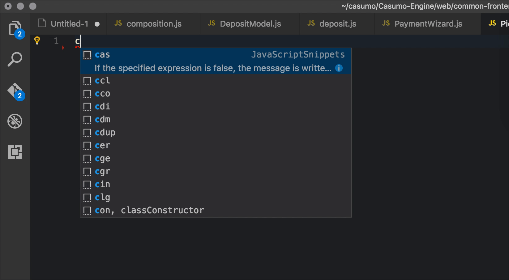

# console.log() snippet for VS Code
The only plus in this snippet is that **it adds those separator lines around your log** which can make it easier to spot
your logs if you have a lot of other logs in the console, or if they are hard to filter.

## Install
Just got to extensions (`Shift+Cmd+X`), and type `console.log` in the search bar. Install the extension and click `Reload`.

## Displaying your snippets as first suggestions
As you can see in the example on the top, the snippets appear as the first suggestions on autocomplete for me.
This can come very handy, and it is very easy to set up:

1. Open Settings (`Cmd + ,` on Mac)
2. Add the following line to your personal settings: `"editor.snippetSuggestions": "top"`